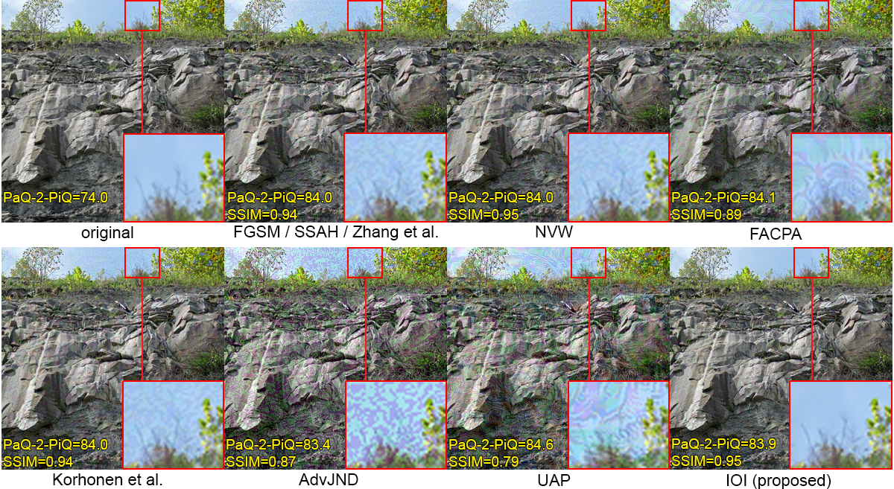
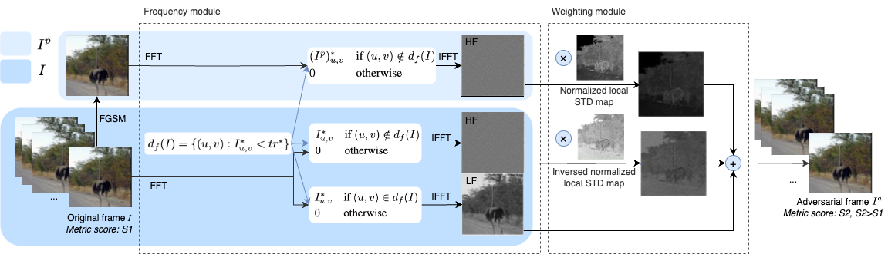

IOI: Invisible One-Iteration Adversarial Attack on No-Reference Image- and Video-Quality Metrics (ICML 2024)
==============
[[ArXiv](https://arxiv.org/abs/2403.05955)] [[ICML poster](https://icml.cc/media/PosterPDFs/ICML%202024/34667.png?t=1720615748.9051435)] [[YouTube video](https://www.youtube.com/watch?v=ylz4eZax--s)]

[](https://drive.google.com/file/d/1Pn0yq5HHXb0GSLJTkmGyhA9iubOd9K1-/view?usp=sharing)

***No-reference image- and video-quality metrics are widely used in video processing benchmarks. The robustness of learning-based metrics under video attacks has not been widely studied. In addition to having success, attacks on metrics that can be employed in video processing benchmarks must be fast and imperceptible. This paper introduces an Invisible One-Iteration (IOI) adversarial attack on no-reference image and video quality metrics. The proposed method uses two modules to ensure high visual quality and temporal stability of adversarial videos and runs for one iteration, which makes it fast. We compared our method alongside eight prior approaches using image and video datasets via objective and subjective tests. Our method exhibited superior visual quality across various attacked metric architectures while maintaining comparable attack success and speed.***


*Comparison of adversarial images generated using [FGSM (2015)](http://arxiv.org/abs/1412.6572), [SSAH (2022)](https://openaccess.thecvf.com/content/CVPR2022/html/Luo_Frequency-Driven_Imperceptible_Adversarial_Attack_on_Semantic_Similarity_CVPR_2022_paper.html), [Zhang et al. (2022b)](https://openreview.net/forum?id=3AV_53iRfTi), [NVW (2021)](https://openreview.net/forum?id=rq2hMS4OaUX), [Korhonen et al. (2022b)](https://dl.acm.org/doi/abs/10.1145/3552469.3555715), [AdvJND (2020)](http://link.springer.com/10.1007/978-3-030-62460-6_42), [UAP (2022)](https://bmvc2022.mpi-inf.mpg.de/790/), [FACPA (2023b)](https://openreview.net/forum?id=xKf-LSD2-Jg) and IOI (ours) attack methods when attacking [PaQ-2-PiQ (2020)](https://github.com/baidut/paq2piq) NR quality metric at one iteration with relative gain aligned*

## Contributions

* We propose an Invisible One-Iteration (IOI) adversarial attack that increases NR image- and video-quality metrics scores. It produces perturbations that are imperceptible and temporally stable in videos. The attack is fast: it does not require convergence and works efficiently with one iteration
* We propose a methodology for comparing adversarial attacks at NR metrics. It is based on aligning attack speed and relative metrics increase after the attack, yielding to comparing only objective and subjective quality of adversarial videos
* We conducted comprehensive experiments using two datasets and three NR models. Four quality metrics were used to demonstrate that the proposed attack generates adversarial images and videos of superior quality compared to prior methods
* We conducted a subjective study on the proposed method's perceptual quality and temporal stability. A crowd-sourced subjective comparison with 685 subjects showed that the proposed attack produces adversarial videos of better visual quality than previous methods

## Proposed Method

### Overview


*An overview of the proposed IOI adversarial attack* 

$I$ is stands for input image, $I^p$ – FGSM attacked image and $I^a$ – the final IOI attacked image.

### Mathematical properties
We provide theoretical restrictions of the generated adversarial images or video frames by the proposed method.

**Theorem 1.** Let $I$ and $I^p$ be original and perturbed image correspondingly, $I^a$ - adversarial image after IOI attack that is based on $I^p$ with truncating parameter $f$. Then inequality (1) is correct, where $MAE^*(\cdot, \cdot)$ is given by Equation (2).

```math
||I^a - I||_{\infty} \leq (1-f) MAE^*(I^p, I) \text{ }\text{ }\text{ }\text{ }  (1)
```

```math
MAE^*(I^p, I) = \frac{1}{HW} \sum_{i=0}^{(H-1)} \sum_{j=0}^{(W-1)} |I^{p*}_{ij} - I_{ij}^*| \text{ }\text{ }\text{ }\text{ }  (2)
```

The proof is presented in the paper.

## PyTorch/Numpy Implementation
We implemented the proposed method using PyTorch and Numpy. See [IOI_demo.ipynb](https://github.com/katiashh/ioi-attack/blob/main/IOI_demo.ipynb). 
The code organized as follows:
1. Download attacked NR quality metric model ([PaQ-2-PiQ](https://github.com/baidut/paq2piq))
2. IOI attack code
3. Attack examples
4. Evaluating on the [NIPS 2017 dataset](https://www.kaggle.com/datasets/google-brain/nips-2017-adversarial-learning-development-set)


## Supplemental materials
You can download the Supplemental materials [here](https://drive.google.com/file/d/1nrvV70Q4W0vh-2FdWrXHUhMDzYcI6zY1/view?usp=drive_link).

## Citation

If you use this code for your research, please cite our paper.

```
@InProceedings{pmlr-v235-shumitskaya24a,
  title =    {{IOI}: Invisible One-Iteration Adversarial Attack on No-Reference Image- and Video-Quality Metrics},
  author =       {Shumitskaya, Ekaterina and Antsiferova, Anastasia and Vatolin, Dmitriy S.},
  booktitle =    {Proceedings of the 41st International Conference on Machine Learning},
  pages =    {45329--45352},
  year =    {2024},
  editor =    {Salakhutdinov, Ruslan and Kolter, Zico and Heller, Katherine and Weller, Adrian and Oliver, Nuria and Scarlett, Jonathan and Berkenkamp, Felix},
  volume =    {235},
  series =    {Proceedings of Machine Learning Research},
  month =    {21--27 Jul},
  publisher =    {PMLR},
  pdf =    {https://raw.githubusercontent.com/mlresearch/v235/main/assets/shumitskaya24a/shumitskaya24a.pdf},
  url =    {https://proceedings.mlr.press/v235/shumitskaya24a.html},
  abstract =    {No-reference image- and video-quality metrics are widely used in video processing benchmarks. The robustness of learning-based metrics under video attacks has not been widely studied. In addition to having success, attacks on metrics that can be employed in video processing benchmarks must be fast and imperceptible. This paper introduces an Invisible One-Iteration (IOI) adversarial attack on no-reference image and video quality metrics. The proposed method uses two modules to ensure high visual quality and temporal stability of adversarial videos and runs for one iteration, which makes it fast. We compared our method alongside eight prior approaches using image and video datasets via objective and subjective tests. Our method exhibited superior visual quality across various attacked metric architectures while maintaining comparable attack success and speed. We made the code available on GitHub: https://github.com/katiashh/ioi-attack.}
}
```
